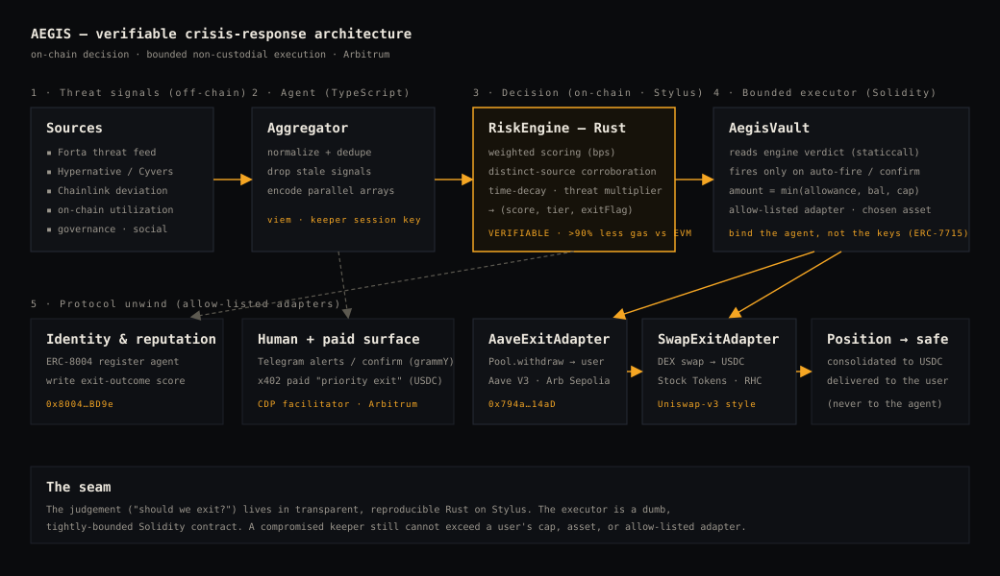

<div align="center">

# 🛡️ AEGIS

### The verifiable crisis-response guardian for DeFi & RWA

**The risk score and the exit decision run on-chain in Arbitrum Stylus. Execution is bounded, non-custodial, and reproducibly verifiable.**

*Arbitrum Open House — London Buildathon 2026 · AI Agentic + Open tracks*

### ▶️ [Watch the 4-minute demo](https://youtu.be/xRSPOUcyjmg)

[Live on Arbitrum Sepolia](#-live-on-arbitrum-sepolia--verified) ·
[How it works](#how-it-works) ·
[Why Stylus](#why-arbitrum-stylus-the-headline) ·
[Quickstart](#quickstart) ·
[Roadmap](#roadmap)

</div>

---

## The problem

When a protocol is exploited or an RWA depegs, **the people who get out in the first
few minutes keep their money. Everyone else eats the cascade.** Crypto theft hit
**~$3.4B in 2025** — flash-loan and oracle attacks remain the dominant DeFi vector, and
state actors set records (DPRK alone stole ~$2B). At that speed, a human watching a
dashboard has already lost.

So a market formed around **autonomous crisis-exit agents** — bots that watch the chain
and yank your funds the instant a threat corroborates. It works: firms like Hypernative
report **$2B+ in prevented losses**. But every one of these systems makes the
**"should I exit?"** decision inside an **opaque, off-chain backend**. You are handing
code you cannot see, audit, or reproduce the authority to move your money.

> **Meet Maya** *(the protagonist of our [demo](https://youtu.be/xRSPOUcyjmg))* — she's not
> a trader; she just moved some savings into **tokenized stocks** on-chain because that
> market never closes. One night, a protocol her assets touch is exploited by a
> flash-loan attack. The people who were awake got out in minutes. **Maya was asleep —
> and woke up to nothing.** Aegis is the guardian that would have saved her: it sees the
> threat, *proves* the verdict on-chain in Stylus, and exits her position to USDC —
> capped, non-custodial — before she opens her eyes, then pings her on Telegram. The demo
> follows Maya's guardian doing exactly that, live on Arbitrum.

Two things must be true for an autonomous guardian to be trustworthy, and today's
designs get neither:

1. **The judgement must be verifiable.** If a bot can panic-sell your portfolio, you
   should be able to read and *reproduce* exactly why.
2. **The agent must be bounded, not trusted.** A compromised agent key should be
   incapable of doing more than the narrow thing you authorized.

## What Aegis does

> **Move the judgement on-chain. Keep the executor dumb and bounded.**
> **Bind the agent, not the keys.**

- The decision engine — risk scoring + the exit trigger — is an **Arbitrum Stylus
  contract written in Rust**. Every weight, threshold, and the full algorithm are
  on-chain, public, and **reproducibly verifiable** (`cargo stylus verify`). The same
  algorithm has a byte-faithful Solidity port and a TypeScript mirror, so any party can
  re-derive every verdict.
- The thing that moves money is **`AegisVault`**, a deliberately simple Solidity
  contract that calls the engine on the hot path and can *only* act within hard on-chain
  bounds: **keeper-only**, fires only on the engine's verdict, **amount-capped**, into a
  **user-chosen asset**, through an **allow-listed adapter**. A stolen keeper key still
  can't exceed the user's mandate.

This is the upgrade over today's crisis-exit bots: **the black box becomes a glass box,
and the trigger becomes provably constrained.**



## How we stand out

| | Off-chain crisis bots (Hypernative, Chaos Labs, …) | **Aegis** |
|---|---|---|
| Where the verdict is computed | Opaque, proprietary backend | **On-chain in Stylus, reproducibly verified** |
| Custody / authority | Trust their infra to move funds | **Non-custodial, bounded mandate** (cap + asset + adapter) |
| Auditability | "Trust us" | **Read the weights on-chain; re-derive the score** |
| Access | Enterprise, closed | **Permissionless, composable, open-source** |

The incumbents *prove the market is real and valuable* — Aegis's wedge is the one thing
their architecture can't offer: **a decision you can verify and an executor you don't
have to trust.** That's only possible because the heavy scoring runs cheaply on Stylus.

## How it works

```
threat signals ─▶ agent (hygiene + encode) ─▶ Stylus RiskEngine.score()
                                                        │  (score, tier, exitFlag)
   T1 alert ◀───────────────────────────────────────────┤
   T2 confirmation window ◀──────────────────────────────┤   (human-in-the-loop)
   T3 auto-fire ─▶ AegisVault.evaluateAndExit (bounded) ──┘ ─▶ adapter ─▶ USDC to user
```

The scoring algorithm ([`packages/risk-engine/src/scoring.rs`](packages/risk-engine/src/scoring.rs)):

1. weight each signal: `severity × confidence × source_trust × class_weight × time_decay` (basis points);
2. aggregate per attack class; track distinct sources with a 32-bit bitmask;
3. **corroboration bonus** (×1.5) for any class confirmed by **≥2 distinct, contributing** sources — an on-chain popcount;
4. sum → apply a global **threat-environment multiplier** → clamp to 100%;
5. **auto-fire** override for classes with ~0% historical recovery (bridge-verifier, DPRK-attributed);
6. else derive the tier from the T2 (45%) / T3 (75%) thresholds.

Tiers: `0` nominal · `1` alert · `2` confirm (opens a user window) · `3` auto-fire.

## Why Arbitrum Stylus (the headline)

That scoring routine is nested iteration + per-class aggregation + a bitmask popcount +
fixed-point decay math — **compute-heavy and storage-light.** That is *exactly* the
workload Arbitrum says to move into Stylus, where **compute is priced 10–100× cheaper**
than the EVM (WASM runtime + optimizing Rust compiler). Putting verifiable risk scoring
on-chain is only economical *because* of Stylus.

And the seam itself is the part most teams won't attempt: **`AegisVault` (Solidity)
calls `RiskEngine` (Stylus/Rust) directly, on the hot path of a money-moving
transaction**, via `IRiskEngine.sol`. We don't assert the saving — we make it
reproducible: the Rust engine, a [Solidity port](packages/contracts/src/mocks/ReferenceScorerSol.sol),
and a [TS mirror](packages/web/src/lib/scoring.ts) all derive identical verdicts, and
`forge test --match-contract GasBench` prints the Solidity baseline to compare against.

## 🟢 Live on Arbitrum Sepolia · verified

The Stylus engine is deployed, activated, and **reproducibly verified** — `cargo stylus
verify` reports *“VERIFIED — contract matches local project's file hashes,”* i.e. the
on-chain bytecode is a reproducible build of the source in this repo.

| Contract | Address |
|---|---|
| **RiskEngine (Stylus, Rust)** ★ *verified* | [`0xdC832Fac3C211E1148D00624c992299B2d954f17`](https://sepolia.arbiscan.io/address/0xdC832Fac3C211E1148D00624c992299B2d954f17) |
| **AegisVault** (bounded executor) *Sourcify-verified* | [`0x8Ac8baCc02F6a605f89D01bCa6d4A500fc525e7E`](https://sepolia.arbiscan.io/address/0x8Ac8baCc02F6a605f89D01bCa6d4A500fc525e7E) |
| MockExitAdapter · tTSLA · USDC | `0xA9F0…5A93` · `0xb2D3…7C62` · `0xa2c0…aBc4` |

**Proof it's real:** the on-chain `score()` returns identically to the Solidity engine,
and a Solidity→Stylus `evaluateAndExit` fired a real bounded exit
([tx](https://sepolia.arbiscan.io/tx/0x0915d65654ad86e5ccf680edee2ebffa11d7d489ede7856abc1fa557d8e224ff)) —
open it on Arbiscan and you'll see the vault's internal call into the Stylus engine and
the USDC landing in the user's wallet. *Don't trust us — verify.*

## Sponsor integrations

| Sponsor | How Aegis uses it | Where |
|---|---|---|
| **Arbitrum Stylus** | The entire risk-scoring + exit-decision engine (Rust), reproducibly verified | `packages/risk-engine` |
| **Robinhood Chain** | Primary RWA target — tokenized Stock Tokens are the protected positions (1,997 already live on Arbitrum) | `SwapExitAdapter`, chain configs |
| **Chainlink** | Trustless on-chain oracle-deviation signal + L2 sequencer-uptime guard, deviation computed *inside* the Stylus engine | `AegisVault.checkOracle`, `agent/signals/chainlink.ts` |
| **ERC-8004** | Register the guardian's on-chain identity; write portable exit-outcome reputation | `agent/src/erc8004` |
| **x402** | Paid "priority exit" endpoint (USDC settlement over HTTP 402) | `agent/src/x402` |
| **ERC-7715 / Delegation** | Keeper modelled as a scoped session key — bounded custody | `AegisVault` (KEEPER_ROLE), `executor/client.ts` |
| **Forta** | Real-time threat feed mapped to attack classes (live API + offline stub) | `agent/src/signals/forta.ts` |
| **grammY** | Telegram action surface: `/status`, `/risk`, `/confirm` + live verdict alerts | `agent/src/telegram` |

## Quickstart

**1 — See the console (no toolchain, no wallet, no deploy):**

```bash
cd packages/web && npm install && npm run dev   # http://localhost:3000  (DEMO mode)
```

**2 — Run it fully on-chain, locally (real engine + vault on anvil, no Stylus toolchain):**

```bash
npm install
npm run deploy:local   # anvil + deploy the Solidity LocalRiskEngine + vault + adapters
npm run web            # LIVE mode — the gauge reads score() from the chain
```

`LocalRiskEngine` runs the **real** algorithm on-chain and exposes the **identical
`IRiskEngine` ABI** as the Stylus engine, so going to production Stylus is a one-line
address swap.

**3 — Verify the scoring core right now (pure Rust, zero setup):**

```bash
cd packages/risk-engine && cargo test
```

**4 — Deploy the real Stylus engine** → [`docs/STYLUS_ACTIVATION.md`](./docs/STYLUS_ACTIVATION.md).
Design deep-dive (the cross-VM seam) → [`docs/ARCHITECTURE.md`](./docs/ARCHITECTURE.md).

## What's verified

- ✅ **Stylus engine** — deployed + activated + **`cargo stylus verify` → VERIFIED** on Arbitrum Sepolia.
- ✅ **Contracts** — `forge test` (24 tests): bounded exits, slippage floor, oracle staleness + sequencer guard, two-step admin, fee-on-transfer accounting, Rust↔Solidity scoring parity. Vault **Sourcify-verified**.
- ✅ **End-to-end** — Solidity→Stylus `evaluateAndExit` fires a real bounded exit on-chain; the autonomous agent drives it live.
- ✅ **Web** — `npm run build`, LIVE wiring (on-chain reads, receipts, on-chain activity log).
- ✅ **Agent** — `tsc --noEmit` clean.

## Repo layout

```
aegis/
├── packages/
│   ├── risk-engine/   Arbitrum Stylus (Rust) — the verifiable decision engine  ★
│   ├── contracts/     Solidity — AegisVault bounded executor, adapters, ScoringLib, tests
│   ├── agent/         TypeScript — signal aggregation, keeper, ERC-8004, x402, Telegram
│   └── web/           Next.js — the tactical guardian console (the demo)
├── docs/
│   ├── ARCHITECTURE.md       the design + the cross-VM seam
│   └── STYLUS_ACTIVATION.md  reproducible Stylus deploy + verify runbook
└── .env.example
```

## Roadmap

- **Mainnet + Robinhood Chain** — protect real tokenized equities and Aave/RWA positions; swap the `LocalRiskEngine` for the verified Stylus engine (one address).
- **Real exit routing** — live Uniswap-v3 + Aave-unwind adapters with on-chain slippage floors; multi-hop / best-route consolidation.
- **Scoped keeper keys** — ERC-7715 session keys (MetaMask Delegation Toolkit) so the keeper is cryptographically bounded, not just role-gated.
- **ERC-8004 reputation market** — guardians compete on a portable, on-chain track record; underwriters price cover off verifiable exit history.
- **x402 priority lane** — a paid fast-exit tier; programmable, agent-to-agent settlement.
- **Governed, adaptive weights** — DAO-tunable scoring config + more signal sources (Cyvers, Hypernative feeds) ratcheting the on-chain threat multiplier.
- **Decentralized keeper network** — many bounded keepers, no single point of failure.

## License

MIT — see [LICENSE](./LICENSE).
